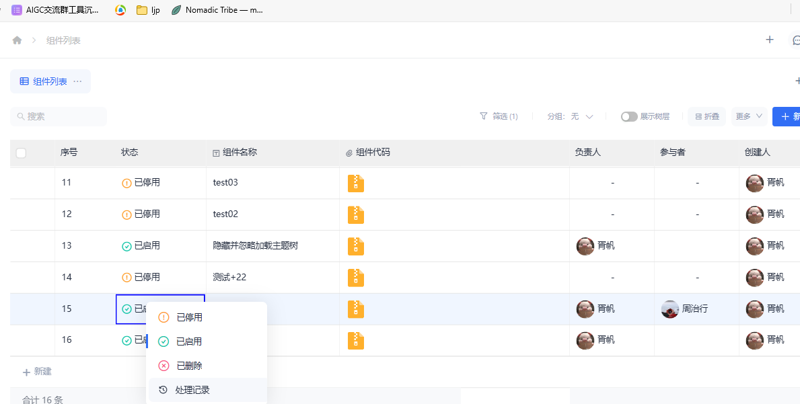
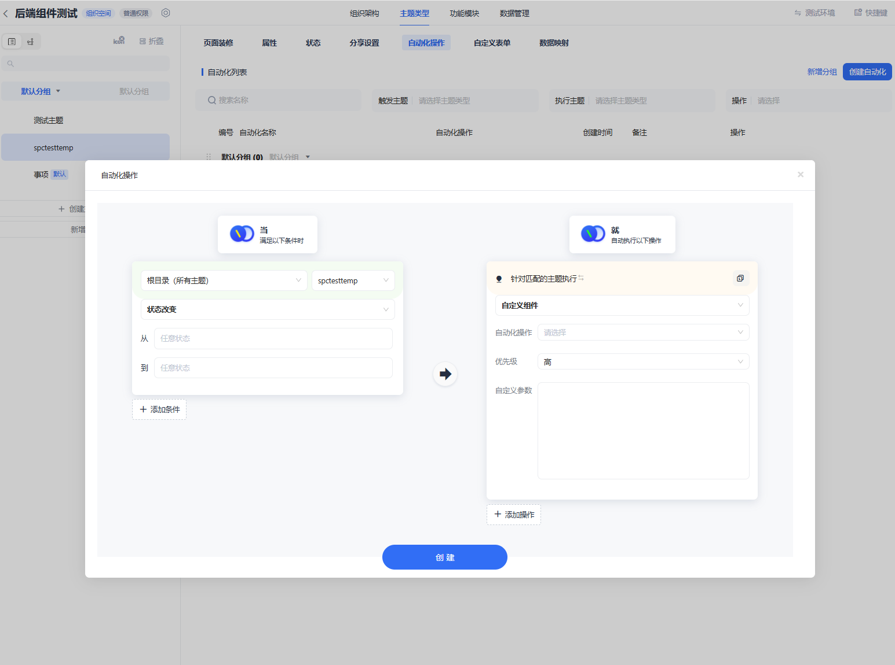
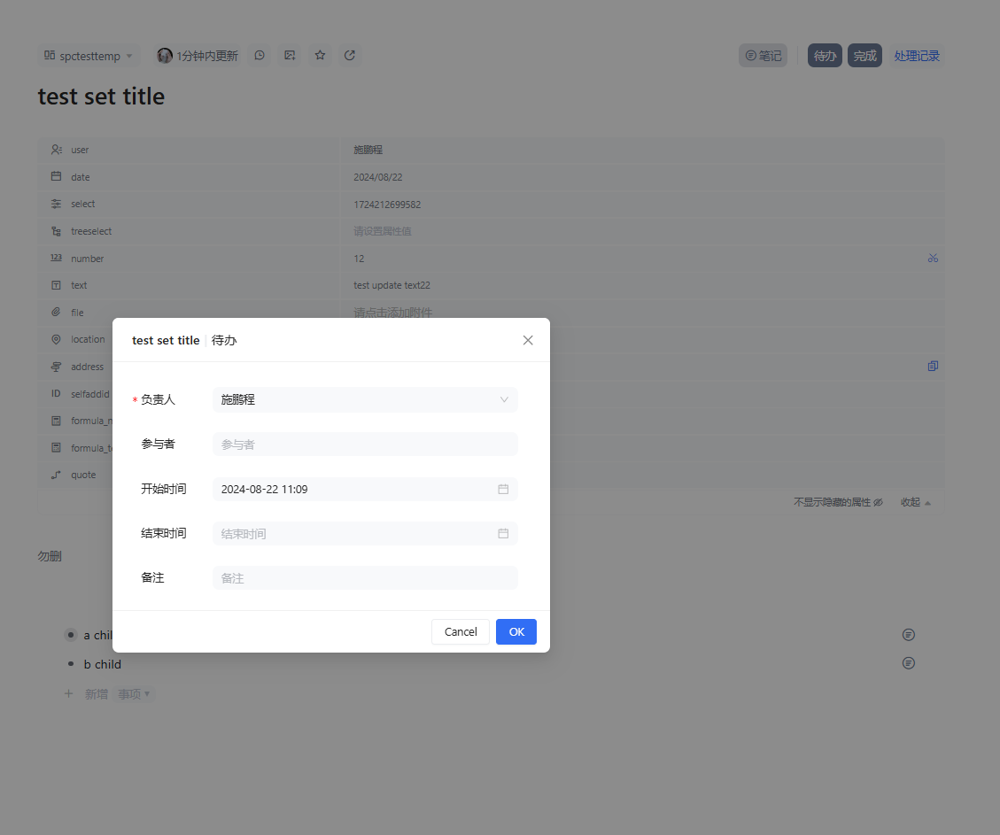
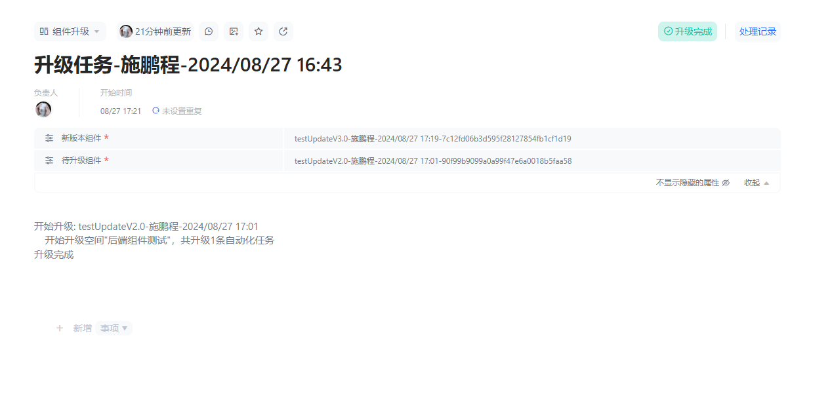

# backend-custom-components

后端自定义组件

## 0. 目录

- [1. 后端自定义组件介绍](#1-后端自定义组件介绍)
- [2. sdk结构、功能](#2-sdk结构功能)
- [3. 自定义组件开发过程](#3-自定义组件开发过程)
- [4. 自定义组件管理和配置运行](#4-自定义组件管理和配置运行)
    - [组件管理：](#组件管理)
    - [配置运行：](#配置运行)
- [5. SDK功能一览](#5-sdk功能一览)
    - [1. 依赖](#1-依赖)
    - [2. 节点数据操作](#2-节点数据操作)
        - [2.0 示例：](#20-示例)
        - [2.1 获取节点](#21-获取节点)
        - [2.1.1 节点基础信息（父子关系、创建时间编辑者等等）](#211-节点基础信息父子关系创建时间编辑者等等)
        - [2.2 获取节点属性](#22-获取节点属性)
        - [2.3 设置节点属性值](#23-设置节点属性值)
        - [2.4 节点状态_1 （可配置、转换状态信息功能）](#24-节点状态_1-可配置转换状态信息功能)
            - [2.4.1 节点状态_2（节点已删除、处于草稿箱、回收站等）](#241-节点状态_2节点已删除处于草稿箱回收站等)
        - [2.5 在节点上发送消息](#25-在节点上发送消息)
    - [3. 空间特殊操作](#3-空间特殊操作)
        - [3.1 获取空间根节点](#31-获取空间根节点)
        - [3.2 获取成员昵称映射](#32-获取成员昵称映射)
        - [3.3 更新空间版本](#33-更新空间版本)
        - [3.4 调用定制api](#34-调用定制api)
    - [4. 数据源操作](#4-数据源操作)
- [6. 组件维护（更新、删除）](#6-组件维护更新删除)
    - [更新组件一般步骤：](#更新组件一般步骤)
    - [批量升级：](#批量升级)
        - [批量升级示例](#批量升级示例)

## 1. 后端自定义组件介绍

连接派零代码平台支持配置指定自动化，对于超出预设自动化能力的需求，支持用户编写自定义组件，上传到组件仓库空间，供用户配置自动化操作使用。
组件示例：

```node
const TaskPool = require('@mylinkpi/task_pool');
const Decimal = require('decimal.js');
let logNode;
const test = true;

/**
 * 示例：当触发加入购物车操作: 找到指定的购物车节点，对购物车中的所有待购商品统计，更新购物车总价。 可进一步生成订单节点、删除购物车中的商品节点等操作。
 * 该批量更新操作使用内置TaskPool工具进行并发控制
 * 示例
 * @param ljp_sdk {LJP_SDK}
 * @param task {Task}
 * @returns {Promise<void>}
 */
async function demo(ljp_sdk, task) {
    if (test) {
        task.parm = task.parm ?? {};
        task.parm.pro_temp_id = '95C133535F8011EF8E691070FD936D58';
        task.parm.car_node_id = '89fb12047f3b4d0db0c01ddd30f23ca4';
    }
    const car_node_id = task.parm.car_node_id ?? task.n; // 触发本次操作的 购物车节点ID(使用npm run test测试时，会传入根节点id, 所以这里用param判断，如果是测试，则使用param中的car_node_id, 否则使用n中的节点id)
    const pro_temp_id = task.parm.pro_temp_id; // 待购商品主题类型ID
    const car_node = (await ljp_sdk.getNodes([car_node_id]))[0]; // 获取购物车节点
    logNode = car_node;
    await car_node.send_message(JSON.stringify(task, null, 2)); // 记录日志  通过节点发送消息
    let pro_to_order = await car_node.children(); // 获取购物车中的所有子节点
    pro_to_order = pro_to_order.filter((node) => node.temp_id === pro_temp_id); // 过滤出待购商品节点
    await log(`pro_to_order.length: ${pro_to_order.length}`); // 记录日志  通过节点发送消息
    let sum = 0;
    for (const node of pro_to_order) {
        const a = node.getPropByName('price'); // 获取商品价格
        const b = node.getPropByName('quantity'); // 获取商品数量
        if (!!a && !!b)
            sum += new Decimal(a).mul(b).toNumber(); //使用精确计算库计算总价
        else {
            throw new Error('商品节点缺少价格或数量属性');
        }
    }
    const taskpool = new TaskPool(32);
    await taskpool.push(car_node.set_prop('总价', sum)); // 设置购物车总价 属性
    await Promise.all(taskpool); // 等待所有任务完成
    await ljp_sdk.updateVersion(); // 让前端同步数据
}

//自定义一个debug用的log函数
async function log(message) {
    if (logNode) {
        console.log(`message on ${logNode.title}`, message);
        await logNode.send_message(message);
    }
}

module.exports = demo;

```

### 组件结构

1. 代码结构： 自定义组件的结构是一个nodejs模块，模块导出一个函数。
2. 函数结构：异步函数接受两个参数：ljp_sdk和task。
3. ljp_sdk是平台提供的sdk，绝大部分功能通过调用此sdk对象实现。
4. task包含组件被调用前 产生的基础信息：

```node
task =
    {
        n: "", // 触发本次操作的节点id
        ad: '',//触发本次操作的用户id。（一般是配置自动化的用户）
        parm: { // 开发者提供的自定义参数。（在配置自动化界面输入）
            "a": 1,
            "b": 2
        }
    }
```
> ⚠️ **IMPORTANT NOTICE:**\
> 本地调试时由于没有触发过程，task.n会默认使用env.js 中定义的节点id\

## 2. sdk结构、功能

-
    1. sdk实现：通过封装连接派后端api接口，提供了一系列的数据操作和任务操作功能。
-
    2. sdk类名叫SDK, 位置在 /backend-custom-components/ljp_sdk.js
-
    3. 组件开发中的sdk使用：组件注释引用{LJP_SDK}类型定义，即可在组件函数中使用sdk提供的功能。

## 3. 自定义组件开发过程

自定义组件开发过程分为以下几个步骤：登录，配置环境，开发组件，测试组件，打包上传。

-
    1. 使用登录脚本，登录连接派平台账号。 可选中英文，可选验短信证码或账密登录。

```shell
npm run login
```

-
    2. 配置环境，编辑env.js文件，配置目标用户空间信息(在测试脚本中会被自动引用,用于初始化sdk对象)

```node
//env.js: 在此配置目标用户空间信息(在测试脚本中会被自动引用,用于初始化sdk对象) , 配置测试测试触发节点id（本地调试组件时，task.n 的值）
const path = require('node:path');
module.exports = {
    LJP_URL_PREFIX: 'https://t****pi.com:8008/', // 填写对应环境的网址
    TEST_ORG: '', // 填写测试ORG_ID, 用于测试时实例化sdk对象
    TEST_NODE: '', // 填写测试触发点node_id
    DEMO_ORG: 'D3B7F181D7B5267DA56062643B0A84AE',
    LOGIN_FILE: path.join(__dirname, '.login'), // 登录信息保存位置
    //...
};
```
> ⚠️ **IMPORTANT NOTICE:**\
> 本地调试时由于没有触发过程，task.n会默认使用env.js 中定义的节点id: TEST_NODE\
-
    3. 开发组件，编辑index.js文件，实现组件功能。

```node

//编辑index.js: 使用sdk制作组件
/**
 * @param ljp_sdk {LJP_SDK} //使用类型注释引用SDK类型定义，即可在开发中引用sdk提供的工具
 * @param task {Task}
 * @returns {Promise<void>}
 */
async function main(ljp_sdk, task) {

    console.log('固定输入参数', JSON.stringify(task.param, null, 2))//查看可配置的固定输入参数

    const temp_node = await ljp_sdk.getTempNode('测试主题');
    const task_pool = new TaskPool(32);
    for (const node of temp_node) {
        const 测试文本 = node.getPropByName('文本');
        const 测试数字 = node.getPropByName('数字');
        console.log(测试文本, 测试数字);
        await task_pool.push(node.set_prop('数字', 测试数字 + 1));
    }
    await Promise.all(task_pool);
    await ljp_sdk.updateVersion();
}

module.exports = main;
```

-
    4. 测试组件本地运行效果

```shell
npm run debug //本地测试组件功能, 脚本调用/index.js中的导出函数, 可debug
```

-
    5. 测试组件在平台上的实际运行效果: (包含自定义依赖库的编译打包后的独立组件) (先将准备测试的组件代码复制到index.js中)

```shell
npm run clean //清理/dist/* 和 dist.zip 
npm run build //编译打包/index.js, 覆盖写入/dist/index.js
npm run test  //(本地触发时，传入的如触发节点id为根节点id，如果组件对触发节点类型有特别编程，测试时可以写死使用的触发节点id：task.n)
```

-
    6. 打包为zip：

```shell
npm run pack  //压缩编译后的/dist/index.js的内容为dist.zip
```

-
    7. 上传zip：

```shell
npm run upload   //需要输入组件名称，如：批量计算v1.0,  以节点为单位保存到组件仓库空间供用户管理 
```

> ⚠️ **IMPORTANT NOTICE:**\
> 上传压缩包是编译后文件，所以请本地备份保管组件源代码\
> 对节点数据修改完毕后需要调用sdk.updateVersion()，让前端同步数据\
> 组件触发配置页面可输入自定义参数，组件代码中通过task.param获取\

-
    8. 上传成功后，可在组件仓库配置可见性，然后可在组件目标空间配置自动化操作，配置触发条件和要执行的组件。

## 4. 自定义组件管理和配置运行

### 组件管理：

在组件仓库空间管理，通过修改节点属性控制组件可见性。\
状态：已启用、已禁用、已删除（禁用则不可见，不可运行）\
参与者：被包含的人可在自动化配置看到此组件\
创建人：同上\
负责人：同上\
是否公开：是否对所有人可见\


### 配置运行：

管理好可见性并且状态为启用后，拥有组件权限的用户可以进入空间设置，在主题类型>选择主题>自动化操作 菜单中，可在指定的主题中配置触发条件 和要执行的组件。

执行操作可额外配置优先级、传入参数。 传入参数是一个json对象文本，组件中通过task.param获取。

```node
//组件使用参数：{a:1, b:2}
async function main(ljp_sdk, task) {
    const param = task.param;
    console.log(param.a, param.b);
}
```

## 5. SDK功能一览

### 1. 依赖

SDK的工具函数定义在 `type.d.ts` 中，在组件注释中引用类型可方便地进行开发。

```node
/**
 * @param {LJP_SDK} ljp_sdk  // 使用类型注释引用SDK类型定义，即可在开发中引用sdk提供的工具
 */
async function demo(ljp_sdk, task) {
//...  
}  
```

### 2. 节点数据操作

#### 2.0 示例

```node
//get node 通过节点ID或主题类型名称获取节点对象列表
const nodes = await ljp_sdk.getNodes(['节点ID']);
const nodes = await ljp_sdk.getTempNode('主题类型名称/主题类型id');
const node = nodes[0];

//node info 节点信息
const org_id = node.org_id; // 获取节点所在组织ID
const node_id = node.node_id; // 获取节点ID
const title = node.title; // 获取节点标题
const temp_id = node.temp_id; // 获取节点主题类型ID
const r = await node.set_title('新标题'); // 设置节点标题

//prop 节点属性值操作
const value = node.getPropByName('属性名称');// 获取属性值by属性名
const propIndex = node.getPropIndexByName('属性名称');// 获取属性坐标
const r = await node.set_prop([1, 3, 10], [v1, v2, v3]);//批量更新属性值 by prop index
const r = await node.set_prop(['name1', 'name3', 'name10'], [v1, v2, v3]);//批量更新属性值 by prop name

//status 状态 
const node = (await sdk.getNodes([nodeId]))[0];
const statusIndex = await sdk.getStatusIndexByName(tempId, '状态名称'); // 了解某主题，某状态对应的坐标
const statusIndex = await node.status_index; // 获取目标节点的状态坐标
const status_prop = ['负责人id', ['参与人id', '参与人id'], Date.now(), Date.now() + 10000, '备注0']//状态信息结构
const r = await node.set_status_index('状态名称或 坐标数字', status_prop); // 设置节点状态 和状态信息
assert(r === true)

//message 消息
const r = await node.send_message('消息内容'); // 在节点上发送消息

//节点搜索
const nodes = await sdk.searchNode('商品0', [
    {
        index: 'proName',
        value: ['火柴'],
        op: 'and',
    },
]);
if (nodes.length === 0) {
    throw new Error('未找到节点');
}

//tree 节点树结构操作
// > ⚠️ **IMPORTANT NOTICE:**\
// > 如果移动到子节点或后代节点,将导致web端崩溃,和潜在的后端任务无限循环
const result = await node.move_to('父节点id', '前一个兄弟节点id(可选)');//移动节点 

const nodes = await node.children(); // 获取子节点

//新增节点
const child_info = { // 新增节点信息
    title: '新节点标题',
    temp_id: '主题id或 主题名', //设置新增节点的主题类型id
    prop: {
        //设置新增节点的属性值
        属性名1: '属性值1',
        属性名2: '属性值2',
    },
    status_index: sdk.getStatusIndexByName('节点主题名', '待办')// 设置新增节点的状态
};
const child_list = [child_info];
const node = nodes[0];
const newNodes = await node.insert_children(child_list); //批量新增节点，返回新增节点对象列表

// 
```

[节点发送消息效果图](doc/img/img_1.png)\
以上修改操作者和消息发送者，都记录操作者身份，身份为组件开发者的登录身份。

#### 2.1 获取节点:

通过节点ID或主题类型名称获取节点对象列表。

```node
const nodes = await ljp_sdk.getNodes(['节点ID']);
const nodes = await ljp_sdk.getTempNode('主题类型名称/主题类型id');  
```
#### 2.1.1 节点基础信息（父子关系、创建时间编辑者等等）
```node
/**
 * 示例 doc/example/get_node_check_nodeinfo.js
 * @param ljp_sdk {LJP_SDK}
 * @param task {Task}
 * @returns {Promise<void>}
 */
async function demo(ljp_sdk, task) {
  const temp_node = await ljp_sdk.getTempNode('测试主题');
  for (const node of temp_node) {
    console.log(node.node_status.index, node.node_status.which, node.node_status.is.normal);
    console.log('空间id：', node.org_id);
    console.log('节点id', node.node_id);
    console.log('创建时间戳', node.create_time);
    console.log('创建人id', node.creator);
    console.log('更新时间戳', node.update_time);
    console.log('更新人id', node.modifier);
    console.log('节点标题', node.title);
    console.log('节点类型名称', node.temp_name);
    console.log('节点类型id', node.temp_id);
    console.log('节点状态名称', node.status_name);
    console.log('节点状态坐标值', node.status_index);
    console.log('节点的父节点id', node.parent);
    console.log('第一个子节点id', node.first_child);
    console.log('最后一个子节点id', node.last_child);
    console.log('上一个相邻节点（哥哥节点）id', node.elder_brother);
    console.log('下一个相邻节点（弟弟节点）id', node.little_brother);
    console.log('节点版本号', node.version);
  }
}
module.exports = demo;
```
输出：
```shell
npm run test_demo
> backend-custom-components@1.0.0 test_demo E:\WebstormProjects\test\backend-custom-components
> node test.js demo

0 normal/正常 true
空间id： D3B7F181D7B5267DA56062643B0A84AE
节点id 243b2b5c67e244d792c997cea866a614
创建时间戳 1723711389539
创建人id E9CD6BFEEE7C11EA8AFF7085C2D76860
更新时间戳 1724206342297
更新人id E9CD6BFEEE7C11EA8AFF7085C2D76860
节点标题 test
节点类型名称 测试主题
节点类型id 3DF181905AD511EF8E691070FD936D58
节点状态名称 点一下右边+1
节点状态坐标值 0
节点的父节点id f2ce55635c29260b15c7fd5fab0e100d
第一个子节点id null
最后一个子节点id null
上一个相邻节点（哥哥节点）id 50ff312534e69d3f8e4b110fee501372
下一个相邻节点（弟弟节点）id 26e7a0f6d9dc4010a93ff5f8fd5d9a61
节点版本号 290
test ok

进程已结束，退出代码为 0
```


#### 2.2 获取节点属性

通过属性名称获取节点属性的坐标，并读取属性值。

```javascript  
const node = (await sdk.getNodes([nodeId]))[0];
const propIndex = node.getPropIndexByName('属性名称');  // 获取属性坐标
const value = node.getPropByName('属性名称');   // 获取属性值by属性名
```    

支持的属性类型： - 文本类型 - 数字类型 - 附件类型 - 用户类型 - 日期类型 - 文本公式 - 引用类型 - 选值 - 多级选值 - 定位 - 地址 - 自增ID类型

#### 2.3 设置节点属性值

通过属性名称设置节点属性值。

```javascript
const node = (await sdk.getNodes([nodeId]))[0];
node.set_prop('属性名称', '新的值');
n
```    

#### 2.4 节点状态_1 （可配置、转换状态信息功能）


主题类型可配置节点的可选状态，状态可以是一个名称标记，也可以包含丰富的信息：（包含状态负责人、参与人、开始时间、结束时间、备注 五个字段）\
节点的状态用一个数字坐标表示，状态信息用一个数组对象表示：['状态负责人', ['参与人1','参2'], 开始时间ms, 结束时间ms, '备注']\
状态信息的人员用用户id字符串表示，时间用毫秒数表示,开始和结束不能相同，备注用字符串表示。

```javascript  
const node = (await sdk.getNodes([nodeId]))[0];
const statusIndex = await sdk.getStatusIndexByName(tempId, '状态名称'); // 了解某主题，某状态对应的坐标
const statusIndex = await node.status_index; // 获取目标节点的状态坐标

//状态信息结构
const status_prop = ['负责人id', ['参与人id', '参与人id'], Date.now(), Date.now() + 10000, '备注0']
const r = await node.set_status_index('状态名称或 坐标数字', status_prop); // 设置节点状态 和状态信息
assert(r === true)
```    

##### 2.4.1 节点状态_2（节点已删除、处于草稿箱、回收站等）
```node
//测试这些节点id：
 const test_node = {
    draft: 'a2dfc211a37a4ed691978f4c210a0ab1',
    deleted: '7aa74c58edb8411aa73d10436ca5ab38',
    normal: '7e85287057814194b51ceb443393ab38',
    // unknown :'7e85287057814194b51ceb443393ab38',
    recycle: '3b7edef9832e4872be36e6170babb6b2',
};
const [node_draft] = await sdk.getNodes([test_node.draft]);
console.log(node_draft.node_status.index) //: 草稿箱状态坐标, 等于NODE_STATUS.draft.index:  -2
console.log(node_draft.node_status.which) //: 草稿箱状态名称, 等于NODE_STATUS.draft.name: 'draft/草稿箱'
console.log(node_draft.node_status.is.draft) //: 是否处于草稿箱状态 : true
console.log(node_draft.node_status.is.deleted) //: 是否处于删除状态 : false
```
场景：过滤处于正常状态的节点，不包含草稿箱、回收站、已删除等状态的节点。
```node
const nodes = 
    await sdk.getChildNodes('父节点id')
        .then(nodes => nodes.filter(node => node.node_status.is.normal));
```
查看预定义的类型
```node
const NODE_STATUS = {
    draft: {
        index: -2,
        name: 'draft/草稿',
    },
    deleted: {
        index: -1,
        name: 'deleted/删除',
    },
    normal: {
        index: 0,
        name: 'normal/正常',
    },
    unknown: {
        index: 1,
        name: 'unknown',
    },
    recycle: {
        index: 2,
        name: 'recycle/回收站',
    },
};
```


#### 2.5 在节点上发送消息

在指定节点上发送消息。

```javascript  
const node = (await sdk.getNodes([nodeId]))[0];
const result = await node.send_message('消息内容');  
```    

[节点发送消息效果图](doc/img/img_1.png)

#### 2.6 新增节点

两步：1.准备一个父节点，2.准备一个或多个子节点信息，调用父节点的insert_children方法。
效果：父节点下新增一个或多个子节点。

```node
chartNode = 购物车节点
pro = 商品节点
const r0 = await chartNode.insert_children([{
    title: '火柴', // 新节点标题
    temp_id: '待购物', // 新节点主题类型id 或 主题类型名称
    prop: {  // 新节点所有属性值
        proId: pro.getPropByName('proId'),
        quantity: 23,
        datetime: Date.now(),
    },
    status_index: ljp_sdk.getStatusIndexByName('待购物', '待办'), // 新节点状态坐标
}]);
if (r0.length === 0) {// 返回结果是新增节点对象列表
    throw new Error('插入失败');
}
console.log('chart:', chartNode.title, '新增待购物:', r0[0].title, r0[0].getPropByName('quantity'), '个');
```

#### 2.7 搜索节点

两步：1.确定节点的类型，2.确定节点的属性\
可选：3.确定节点的状态\
额外可选：4.确定节点的负责人，5.确定节点的参与人\
效果：返回符合条件的节点列表。

```node
//火柴的单价是多少？
const nodes = await ljp_sdk.searchNode(
    '商品0', //节点类型 
    [
        {
            index: 'proName', //属性的坐标或属性的名称
            value: ['火柴'],   // 属性的值
            op: 'and',        // 逻辑操作符
        },
        {
            ...更多属性匹配条件
        }
    ],
    {
        status_index: [0, 1, 2], //状态坐标 or
        status_owner: ['BB5219CFB10011EEAB2D043F72FDCAE0'],  // 状态拥有者
        status_user: { //状态参与者
            op: 'or',
            ad: ['BB5219CFB10011EEAB2D043F72FDCAE0', 'BB5219CFB10011EEAB2D043F72FDCAE0'],
        },
        status_start_time: {begin: Date.now(), end: Date.now()}, //状态开始时间范围
        status_end_time: {begin: Date.now(), end: Date.now()},   // 状态结束时间范围
    },
    { //创建时间范围
        begin: Date.now(),
        end: Date.now(),
    },
    { // 最后编辑时间范围
        begin: Date.now(),
        end: Date.now(),
    },
    ['BB5219CFB10011EEAB2D043F72FDCAE0', 'BB5219CFB10011EEAB2D043F72FDCAE0'], //创建者 or
    ['BB5219CFB10011EEAB2D043F72FDCAE0', 'BB5219CFB10011EEAB2D043F72FDCAE0'], //编辑者 or
    ['火柴', '啤酒'], //标题 or
    {op: 'and', value:['tag1', 'tag2']}
);
if (nodes.length === 0) {
    throw new Error('未找到节点');
}
const price = nodes[0].getPropByName('price');
```

### 3. 空间特殊操作

#### 3.1 获取空间根节点

获取空间根节点对象。

```javascript  
const rootNode = await sdk.getRootNode();  
```    

#### 3.2 获取成员昵称映射

获取当前组织空间内成员ID和昵称的映射。

```javascript  
const nicknameMap = await sdk.getNicknameMap();  
```    

#### 3.3 更新空间版本

更新空间版本，使前端同步数据。

```javascript
const result = await sdk.updateVersion();  
```  

#### 3.4 调用定制api

调用任意api，要传入api路径和参数。

```javascript
const url = 'https://test-inner.linkerpi.com:8008/api/yt/getUserStructure';
const r = await sdk.request({
    method: 'POST',
    uri: url,
    body: {
        // ad:'',
        // token:'',
        // org_id: '',
        // onlySelf:true,
    }
});
assert(r.status === 'ok');

  ```

### 4. 数据源操作

对用户空间配置的数据库，可执行任意sql语句。

```node
//测试脚本示例：
//空间中有数据源名称为：spc测试数据源2，包含表名为：animals， 实际表名为：ljp_2697****1C6BDFB1F_animals, 要执行的sql语句为：select * from  ljp_2697****1C6BDFB1F_animals limit 1
describe('db 数据源操作', () => {
    before(async function () {
        sdk = new SDK('2697****1C6BDFB1F');
        await sdk.init();
    });
    it('get real table name: 获取数据表的实际表名', async () => {
        try {
            const table_name = await sdk.getTableInnerName('spc测试数据源2', 'animals');//参数：数据源名称，表名， 返回：实际表名
            assert(typeof table_name === 'string');
        } catch (e) {
            //当找不到目标的内部表名时，会报错
            console.log(e);
        }
    });
    it('db query 数据库查询操作', async () => {
        //获取表名后，可以进行数据库sql语句执行
        const table_name = await sdk.getTableInnerName('spc测试数据源2', 'animals');//参数：数据源名称，表名， 返回：实际表名
        const sql = `select * from ${table_name} limit 1`;
        const r = await sdk.dbQuery('spc测试数据源2', sql);//参数：数据源名称，sql语句， 返回：查询结果
        assert(r instanceof Array);
    });
});

```

## 6. 组件维护（更新、删除）

每一次npm run upload 成功，都会在组件仓库空间生成一个组件对象。可重名，不会发生覆盖替换现象。
上传时一定要手动在组件名后加版本号, 否则更新时容易出现无法逆转的人为错误。(将意料之外的自动化组件配置替换掉运行组件)

### 更新组件一般步骤：

1. 上传新版本，命名时注意加版本号
2. 在组件仓库空间找到新版本，调整权限（见组件管理）
3. 在组件目标空间配置自动化操作，选择新版本，保存即可。

### 批量升级：

此操作支持将所有指定的组件 替换为 一个指定的组件

1. 上传新版本，命名时注意加版本号
2. 在组件仓库空间找到新版本，调整权限（见组件管理）
3. 在仓库空间的升级列表中， 创建升级任务， 配置新组件、旧组件（可多选）。保存
4. 点击状态按钮：“开始升级” , 升级结果会显示在该节点正文内容中。

#### 批量升级示例

用testV3.0版本替换 testV2.0版本的组件 ：
正文中显示更新了组件的自动化配置的数量，如果与预期数量不符，说明有意料之外的组件的自动化配置使用了旧版本的组件。



