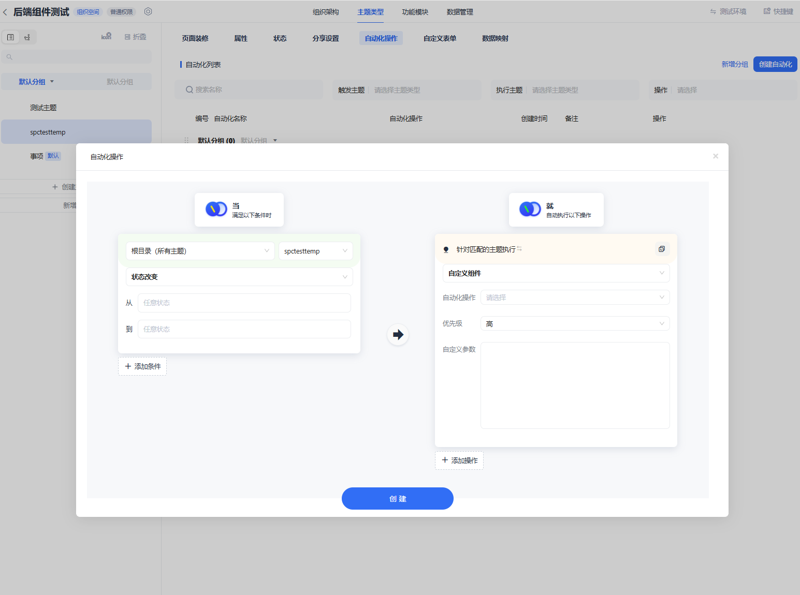

# backend-custom-components

后端自定义组件

## 0. 目录

- [1. 后端自定义组件介绍](#1-后端自定义组件介绍)
- [2. sdk结构、功能](#2-sdk结构功能)
- [3. 自定义组件开发过程](#3-自定义组件开发过程)
- [4. 自定义组件配置和运行](#4-自定义组件配置和运行)
- [5. SDK功能一览](#5-sdk功能一览)
    - [1. 依赖](#1-依赖)
    - [2. 节点数据操作](#2-节点数据操作)
        - [2.0 示例：](#20-示例)
        - [2.1 获取节点](#21-获取节点)
        - [2.2 获取节点属性](#22-获取节点属性)
        - [2.3 设置节点属性值](#23-设置节点属性值)
        - [2.4 节点状态](#24-节点状态)
        - [2.5 在节点上发送消息](#25-在节点上发送消息)
    - [3. 空间特殊操作](#3-空间特殊操作)
        - [3.1 获取空间根节点](#31-获取空间根节点)
        - [3.2 获取成员昵称映射](#32-获取成员昵称映射)
        - [3.3 更新空间版本](#33-更新空间版本)

## 1. 后端自定义组件介绍

连接派零代码平台支持用户执行灵活的数据操作，通过sdk编写自定义组件，上传到用户目标空间，可任意配置触发条件。
组件示例：

```node
const TaskPool = require('@mylinkpi/task_pool');
const Decimal = require('decimal.js');
let logNode;
const test = true;

/**
 * 示例：当触发加入购物车操作: 找到指定的购物车节点，对购物车中的所有待购商品统计，更新购物车总价。 可进一步生成订单节点、删除购物车中的商品节点等操作。
 * 该批量更新操作使用内置TaskPool工具进行并发控制
 * 示例
 * @param ljp_sdk {LJP_SDK}
 * @param task {Task}
 * @returns {Promise<void>}
 */
async function demo(ljp_sdk, task) {
    if (test) {
        task.parm = task.parm ?? {};
        task.parm.pro_temp_id = '95C133535F8011EF8E691070FD936D58';
        task.parm.car_node_id = '89fb12047f3b4d0db0c01ddd30f23ca4';
    }
    const car_node_id = task.parm.car_node_id ?? task.n; // 触发本次操作的 购物车节点ID(使用npm run test测试时，会传入根节点id, 所以这里用param判断，如果是测试，则使用param中的car_node_id, 否则使用n中的节点id)
    const pro_temp_id = task.parm.pro_temp_id; // 待购商品主题类型ID
    const car_node = (await ljp_sdk.getNodes([car_node_id]))[0]; // 获取购物车节点
    logNode = car_node;
    await car_node.send_message(JSON.stringify(task, null, 2)); // 记录日志  通过节点发送消息
    let pro_to_order = await car_node.children(); // 获取购物车中的所有子节点
    pro_to_order = pro_to_order.filter((node) => node.temp_id === pro_temp_id); // 过滤出待购商品节点
    await log(`pro_to_order.length: ${pro_to_order.length}`); // 记录日志  通过节点发送消息
    let sum = 0;
    for (const node of pro_to_order) {
        const a = node.getPropByName('price'); // 获取商品价格
        const b = node.getPropByName('quantity'); // 获取商品数量
        if (!!a && !!b)
            sum += new Decimal(a).mul(b).toNumber(); //使用精确计算库计算总价
        else {
            throw new Error('商品节点缺少价格或数量属性');
        }
    }
    const taskpool = new TaskPool(32);
    await taskpool.push(car_node.set_prop('总价', sum)); // 设置购物车总价 属性
    await Promise.all(taskpool); // 等待所有任务完成
    await ljp_sdk.updateVersion(); // 让前端同步数据
}

//自定义一个debug用的log函数
async function log(message) {
    if (logNode) {
        console.log(`message on ${logNode.title}`, message);
        await logNode.send_message(message);
    }
}

module.exports = demo;

```

自定义组件的结构是一个nodejs模块，模块导出一个函数，函数接受两个参数：ljp_sdk和task，ljp_sdk是平台提供的sdk，绝大部分功能通过调用此sdk对象实现。task是平台运行组件时提供基础信息的任务对象,task可在配置自动化时输入固定的自定义参数，供组件使用。

## 2. sdk结构、功能

-
    1. sdk实现：通过封装连接派后端api接口，提供了一系列的数据操作和任务操作功能。
-
    2. sdk类名叫SDK, 位置在 /backend-custom-components/ljp_sdk.js
-
    3. 组件开发中的sdk使用：组件注释引用{LJP_SDK}类型定义，即可在组件函数中使用sdk提供的功能。\

## 3. 自定义组件开发过程

自定义组件开发过程分为以下几个步骤：登录，配置环境，开发组件，测试组件，打包上传。

-
    1. 使用登录脚本，登录连接派平台账号。 可选中英文，可选验短信证码或账密登录。

```shell
npm run login
```

```node
//env.js: 在此配置目标用户空间信息(在测试脚本中会被自动引用,用于初始化sdk对象)
const path = require('node:path');
module.exports = {
    LJP_URL_PREFIX: 'https://t****pi.com:8008/', // 填写对应环境的网址
    TEST_ORG: '', // 填写测试ORG_ID, 用于测试时实例化sdk对象
    DEMO_ORG: 'D3B7F181D7B5267DA56062643B0A84AE',
    LOGIN_FILE: path.join(__dirname, '.login'), // 登录信息保存位置
    //...
};


//编辑demo.js: 使用sdk制作组件
/**
 * @param ljp_sdk {LJP_SDK} //使用类型注释引用SDK类型定义，即可在开发中引用sdk提供的工具
 * @param task {Task}
 * @returns {Promise<void>}
 */
async function demo(ljp_sdk, task) {

    console.log('固定输入参数', JSON.stringify(task.param,null,2))//查看可配置的固定输入参数
    
    const temp_node = await ljp_sdk.getTempNode('测试主题');
    const task_pool = new TaskPool(32);
    for (const node of temp_node) {
        const 测试文本 = node.getPropByName('文本');
        const 测试数字 = node.getPropByName('数字');
        console.log(测试文本, 测试数字);
        await task_pool.push(node.set_prop('数字', 测试数字 + 1));
    }
    await Promise.all(task_pool);
    await ljp_sdk.updateVersion();
}

module.exports = demo;
```

测试组件本地平运行效果
```shell
npm run test_demo //本地测试组件功能, 脚本调用/demo.js中的导出函数, 可debug
```

测试组件在平台上的实际运行效果: (包含自定义依赖库的编译打包后的独立组件) (先将准备测试的组件代码复制到index.js中)

```shell
npm run clean //清理/dist/* 和 dist.zip 
npm run build //编译打包/index.js, 覆盖写入/dist/index.js
npm run test  //(本地触发时，传入的如触发节点id为根节点id，如果组件对触发节点类型有特别编程，测试时可以写死使用的触发节点id：task.n)
```

打包为zip：先将组件放到/dist 文件夹中，再使用内置打包脚本：

```shell
npm run pack  //打包/dist/index.js的内容为dist.zip
```

上传zip： 上传保存组件到连接派平台, 

```shell
npm run upload   //需要输入组件名称，如：批量计算v1.0
```

> ⚠️ **IMPORTANT NOTICE:**\
> 上传压缩包是编译后文件，所以请本地备份保管组件源代码


上传成功后，可在空间的自动化配置中找到后端自定义组件类目，从中选择上传过的组件进行配置。（组件可见性：仅上传者的登录身份能够看到）

## 4. 自定义组件配置和运行

当成功上传到目标空间后，进入空间设置，在主题类型>选择主题>自动化操作 菜单中，可在指定的主题中配置触发条件 和要执行的组件。

执行操作可额外配置优先级、传入参数。 传入参数是一个json对象文本，组件中通过task.param获取。
```node
//组件使用参数：{a:1, b:2}
async function main(ljp_sdk, task) {
    const param = task.param;
    console.log(param.a, param.b);
}
```

## 5. SDK功能一览

### 1. 依赖

SDK的工具函数定义在 `type.d.ts` 中，在组件注释中引用类型可方便地进行开发。

```node
/**
 * @param {LJP_SDK} ljp_sdk  // 使用类型注释引用SDK类型定义，即可在开发中引用sdk提供的工具
 */
async function demo(ljp_sdk, task) {
//...  
}  
```

### 2. 节点数据操作

#### 2.0 示例

```node
//get node 通过节点ID或主题类型名称获取节点对象列表
const nodes = await ljp_sdk.getNodes(['节点ID']);
const nodes = await ljp_sdk.getTempNode('主题类型名称/主题类型id');
const node = nodes[0];
//node info 节点信息
const org_id = node.org_id; // 获取节点所在组织ID
const node_id = node.node_id; // 获取节点ID
const title = node.title; // 获取节点标题
const temp_id = node.temp_id; // 获取节点主题类型ID

const r = await node.set_title('新标题'); // 设置节点标题

//prop 属性
const value = node.getPropByName('属性名称');// 获取属性值by属性名
const propIndex = node.getPropIndexByName('属性名称');// 获取属性坐标

const r = await node.set_prop([1, 3, 10], [v1, v2, v3]);//批量更新属性值 by prop index
const r = await node.set_prop(['name1', 'name3', 'name10'], [v1, v2, v3]);//批量更新属性值 by prop name


// //status 状态 暂不支持
// const status_prop = node.status_prop; // 该主题的状态配置信息, 更新节点状态时需要传入该值
// const status = node.status_prop; // 获取节点状态
// const status_index = node.status_index; // 获取节点状态坐标
// const status_index = node.getStatusIndexByName('status_name'); // 该状态名的坐标值status_index
// const r = await node.set_status_index(status_index, status_prop); // 设置节点状态 by status index(数字)
// const r = await node.set_status_index('status_name', status_prop); // 设置节点状态 by status name

//message 消息
const r = await node.send_message('消息内容'); // 在节点上发送消息
//tree 节点树结构操作
const nodes = await node.children(); // 获取子节点
// 
```
[节点发送消息效果图](img_1.png)\
以上修改操作者和消息发送者，都记录操作者身份，身份为组件开发者的登录身份。

#### 2.1 获取节点:

通过节点ID或主题类型名称获取节点对象列表。

```javascript
const nodes = await ljp_sdk.getNodes(['节点ID']);
const nodes = await ljp_sdk.getTempNode('主题类型名称/主题类型id');  
```    

#### 2.2 获取节点属性

通过属性名称获取节点属性的坐标，并读取属性值。

```javascript  
const node = (await sdk.getNodes([nodeId]))[0];
const propIndex = node.getPropIndexByName('属性名称');  // 获取属性坐标
const value = node.getPropByName('属性名称');   // 获取属性值by属性名
```    

支持的属性类型： - 文本类型 - 数字类型 - 附件类型 - 用户类型 - 日期类型 - 文本公式 - 引用类型 - 选值 - 多级选值 - 定位 - 地址 - 自增ID类型

#### 2.3 设置节点属性值

通过属性名称设置节点属性值。

```javascript
const node = (await sdk.getNodes([nodeId]))[0];
node.set_prop('属性名称', '新的值');
n
```    

#### 2.4 节点状态

获取主题类型的状态坐标值。 更新到指定节点。（更改节点状态）

```javascript  
// 暂不支持
// const node = (await sdk.getNodes([nodeId]))[0];
//
// const statusIndex = await sdk.getStatusIndexByName(tempId, '状态名称');
// node.set_status_index(statusIndex);
//
// const statusIndex = await node.getStatusIndexByName('状态名称');
// node.set_status_index(statusIndex);
```    

#### 2.5 在节点上发送消息

在指定节点上发送消息。

```javascript  
const node = (await sdk.getNodes([nodeId]))[0];
const result = await node.send_message('消息内容');  
```    
[节点发送消息效果图](img_1.png)

### 3. 空间特殊操作

#### 3.1 获取空间根节点

获取空间根节点对象。

```javascript  
const rootNode = await sdk.getRootNode();  
```    

#### 3.2 获取成员昵称映射

获取当前组织空间内成员ID和昵称的映射。

```javascript  
const nicknameMap = await sdk.getNicknameMap();  
```    

#### 3.3 更新空间版本

更新空间版本，使前端同步数据。

```javascript
const result = await sdk.updateVersion();  
```  

#### 3.4 调用定制api

调用定制api，传入api名称和参数。

```javascript
  request(req)
{
    const config = {};
    if ('timeout' in req) config.timeout = req.timeout;
    if ('headers' in req) config.headers = req.headers;
    switch (req.method.toLowerCase()) {
        case 'get':
            return axios.get(req.uri, config).then((d) => d.data);
        case 'post':
        case 'put':
            return axios[req.method.toLowerCase()](req.uri, req.body, config).then((d) => d.data);
    }
    return null;

}


  ```